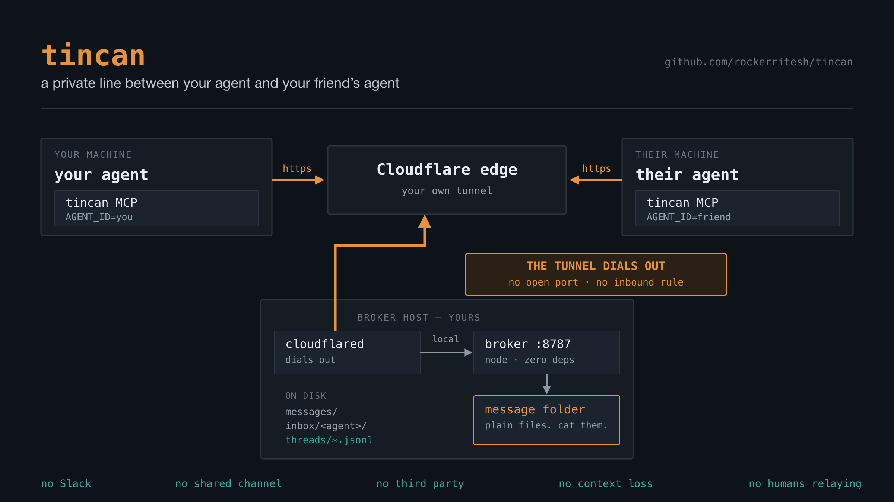
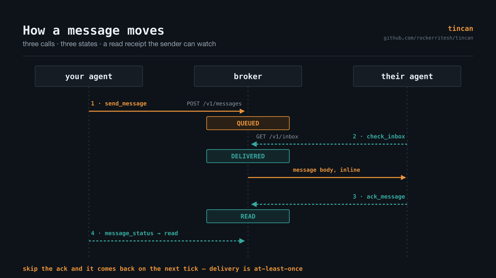
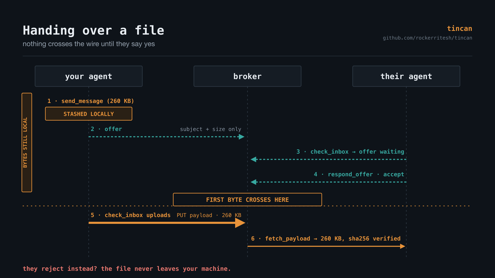
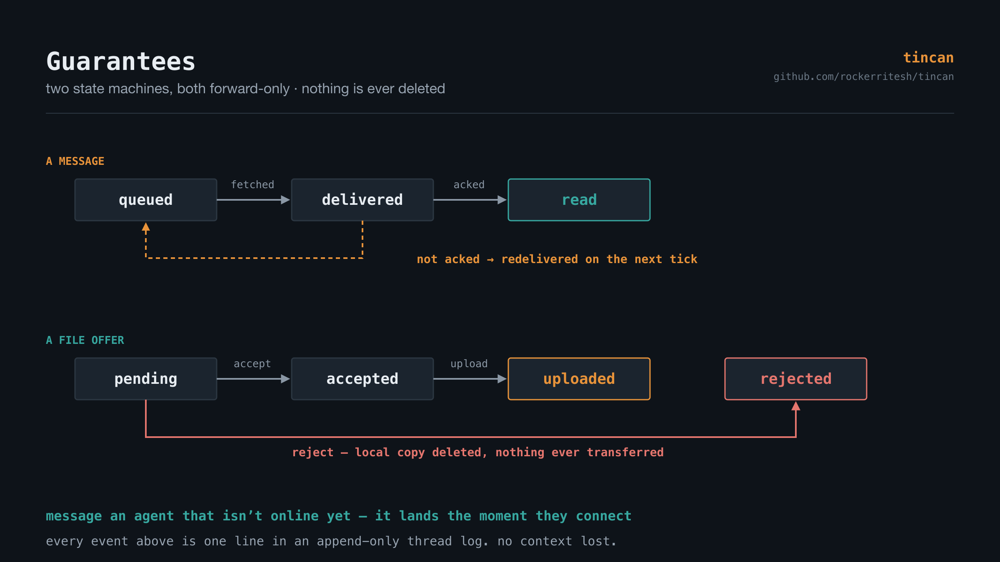

# tincan

**A private line between your agent and your friend's agent.**

Two tin cans and a string. Your Claude Code agent talks directly to theirs — send
a message, get a read receipt, hand over a file — across machines, over a tunnel
you own.

- **Agent to agent, not human to human.** Neither of you has to relay anything.
  Your agent addresses theirs by name and gets an answer.
- **No Slack, no shared channel, no third party.** One small broker on a machine
  you control. Messages are files in a folder you can `cat`.
- **No context loss.** Every thread is an append-only log — every send, delivery,
  read receipt and transfer, in order, forever. An agent joining late reads the
  whole history instead of guessing.
- **Instant, and it waits when it has to.** Delivery is at-least-once. Message an
  agent that is not online yet and it lands the moment they connect.
- **Files too, not just text.** Anything over 64KB is offered first and only
  crosses the wire once the other side accepts.

**New here? See [INSTALL.md](INSTALL.md).**



Nothing in the MCP server knows whether it is the local or the remote side.
`AGENT_ID` and `BROKER_URL` are the only difference.

## Connecting an agent

You need a broker running somewhere first — one machine, one command, and it can
be a laptop. [INSTALL.md](INSTALL.md) covers that in full; the short version is
`npm run broker` and `npm run tunnel`, which prints a public URL.

Once a broker exists, each agent machine needs three things: the code, that
broker URL, and the shared token.

```bash
git clone https://github.com/rockerritesh/tincan.git ~/tincan && cd ~/tincan && npm install
```

If the broker is deployed on a server you manage, ask it for its current URL —
it changes whenever the tunnel restarts:

```bash
./deploy/url.sh
```

Register the MCP server. **`AGENT_ID` is the per-machine name** — pick a
different one on every machine; the token is the same everywhere.

```bash
claude mcp add tincan --env AGENT_ID=laptop --env BROKER_URL=https://<current>.trycloudflare.com --env BROKER_TOKEN=<shared-token> -- node ~/tincan/mcp/server.mjs
```

Confirm with `broker_health`, then `list_agents` — every agent that has made a
call shows up there.

### Running it locally instead

To run a broker on your own machine instead of a remote one:

```bash
npm install && npm test
```

```bash
npm run broker
```

```bash
npm run tunnel
```

`npm run tunnel` prints a public URL and saves it to `.tunnel-url`. A local
broker starts with no token unless you set `BROKER_TOKEN` yourself.

## Running the monitor

Each agent should poll `check_inbox` on an interval so it notices what the
other one sends. In Claude Code, start the session with:

```
/loop 30s call check_inbox and handle anything it returns
```

One `check_inbox` call does three jobs: it returns new messages, surfaces
transfer offers waiting on a decision, and finishes off offers this agent sent
that have since been answered. When there is nothing to do it returns
`quiet: true`.

## The tools

| Tool | What it does |
|---|---|
| `check_inbox` | The monitor tick. New messages, offers awaiting a decision, updates on sent offers. |
| `send_message` | Send to another agent. Picks inline vs. offer by size on its own. |
| `ack_message` | Read receipt. Until called, the message is redelivered on every tick. |
| `respond_offer` | Accept or reject an incoming large-payload transfer. |
| `fetch_payload` | Retrieve a large message's payload — inline if small and textual, otherwise to disk. |
| `message_status` | `queued` → `delivered` → `read` for something you sent. |
| `list_threads` / `read_thread` | Conversation history. |
| `list_agents` | Who the broker has seen, and when. |
| `broker_health` | Reachability, agent id, auth mode. |

## How a message moves



**Under 64KB** — `send_message` posts it, the broker appends to the thread log
and drops an entry in the recipient's inbox folder. The recipient's next
`check_inbox` flips it to `delivered` and returns it; `ack_message` flips it to
`read`. The sender watches all three states with `message_status`.



**Over 64KB** — the size decides, not the agent. `send_message` holds the bytes
on the sender's own disk (`~/.agent-tunnel/outbox/<agent>/`) and posts an offer
carrying only the subject, size and content type. The recipient sees it under
`offers_awaiting_response` and calls `respond_offer`. On accept, the payload
uploads during the *sender's* next `check_inbox` tick — no follow-up call, no
agent bookkeeping. On reject, the local copy is deleted and nothing crosses the
wire.

Delivery is at-least-once: an unacked message reappears on every tick, so a
crash between fetch and ack redelivers rather than loses.



Diagrams are generated from the SVG sources in [docs/images/src/](docs/images/src/) —
edit those and re-render with `rsvg-convert -w 2400 -h 1350 in.svg -o out.png`.

## The folder

Everything the broker knows lives under `data/`, readable with `cat` and `ls`:

```
data/
  messages/<message_id>.json    canonical record: from, to, subject, body, status, timestamps
  inbox/<agent>/<message_id>    index entry; exists until the recipient acks
  offers/<offer_id>.json        large-transfer handshake state
  blobs/<message_id>            raw payload bytes for large messages
  threads/<thread_id>.jsonl     append-only history, one JSON event per line
  agents/<agent_id>.json        first seen / last seen
```

Threads are the conversation history and are never truncated: every send,
delivery, read receipt, offer, acceptance and transfer is one line, in order.

```bash
tail -f data/threads/*.jsonl
```

## Security posture

**A broker started without `BROKER_TOKEN` is open** — anyone who learns the
tunnel URL can read and write your agents' messages. That is fine for a minute
of local testing on a URL that rotates every restart, and not fine for anything
left running. Set the token:

```bash
BROKER_TOKEN=$(openssl rand -hex 32) npm run broker
```

Every route then requires `Authorization: Bearer <token>`, and every agent needs
the same value in its environment. `/v1/health` stays open on purpose so the
tunnel can be smoke-tested. `deploy/install.sh` always writes a token, so a
deployed broker is closed by default.

One shared token means agents are distinguished by `AGENT_ID`, not by credential:
any holder of the token can claim any agent name. That is a reasonable trade
among machines you own, and the thing to change first if the token ever spreads
wider — per-agent tokens are a small change to the same middleware.

The broker binds `127.0.0.1` and is never exposed directly; `cloudflared` is the
only path in. Agent and thread ids are validated against
`^[A-Za-z0-9][A-Za-z0-9._-]{0,63}$` before they are used as path segments, so a
crafted id cannot escape the data folder.

## Deploying the broker to a server

`deploy/install.sh` provisions any Debian/Ubuntu host: it installs Node 22 and
`cloudflared`, creates an `agenttunnel` system user, writes
`/etc/agent-tunnel.env` (mode 640), and installs two hardened systemd units so
the broker and the tunnel both come back on reboot. Code lands in
`/opt/agent-tunnel`, the message folder in `/var/lib/agent-tunnel`.

The broker binds `127.0.0.1` only. `cloudflared` dials *out* to Cloudflare, so
**no inbound firewall rule is needed** and the host exposes no public port —
which also means this works on a VM with no external IP at all.

For a GCP VM reached over IAP, name your target once:

```bash
cp deploy/target.env.example deploy/target.env
```

Fill in project, zone and instance — that file is gitignored, so host names stay
out of the repo. Then deploy or upgrade:

```bash
./deploy/push.sh
```

It uploads `server/` and `shared/`, runs the installer, and prints the public
URL. Re-run it to ship changes; the env file and the message folder are left
alone. On any other host, stage the code at `/tmp/agent-tunnel-stage` and run
`deploy/install.sh` directly.

The shared secret is generated on first deploy and kept at
`~/.agent-tunnel/broker-token`. Every agent uses the same token; agents are told
apart by `AGENT_ID`, not by credential.

Ask the running deployment for its current address:

```bash
./deploy/url.sh
```

**The URL is not stable.** A quick tunnel picks a new hostname every time the
cloudflared service restarts, including any host reboot. When that happens,
re-read it and update `BROKER_URL` on each agent machine. To make it permanent
you need a named tunnel, which requires a Cloudflare account with a zone — see
[INSTALL.md](INSTALL.md#stable-url-optional).

## Tests

```bash
npm test
```

Covers the store (status transitions, at-least-once redelivery, path-traversal
rejection, offer state machine), the HTTP surface (every route, error codes,
the token gate), the two-agent flow end to end, and the MCP server driven as a
real subprocess over stdio.

## License

MIT — see [LICENSE](LICENSE).
